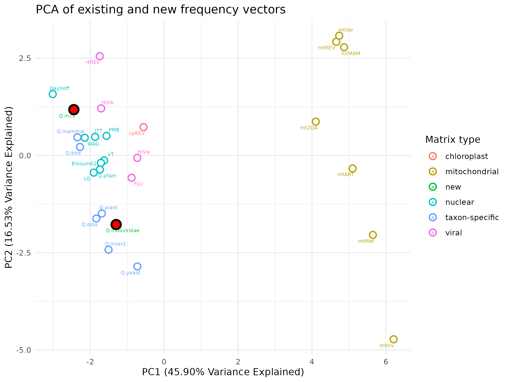
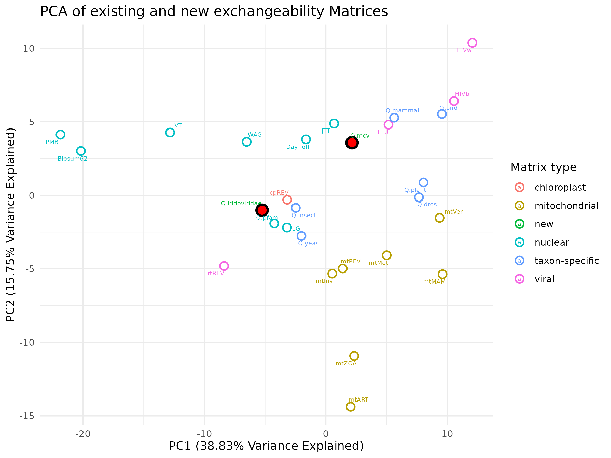

# Phylogenomic analysis 

## About 
This repository houses the details of my bioinformatic pipeline for my phylogenetic analyses of megalocytiviruses, a group of fish pathogens exotic to Australia, and other members of the family *Iridoviridae*. A set of core genes are first identified followed by phylogenetic analysis of the core genes. 

Go to the file `setup.md` in this repository, for information about how to set-up a conda environment. The same file houses information on how to complete basic tasks like transfering files and fixing errors you might receive while completeing this analysis. You will need the following software:
* [Prokka](https://github.com/tseemann/prokka) (version 1.14.5)
* [OrthoFinder](https://github.com/davidemms/OrthoFinder) (version 2.5.4)
* Geneious Prime (version 2020.2.5)
* [MUSCLE5](https://github.com/rcedgar/muscle) (version 5.0.1428)
* [TrimAL ](https://github.com/inab/trimal) (version 1.4.1r22) 
* [IQ-TREE](https://github.com/iqtree/iqtree2) (version 2.2.0.5)
* [R Script](https://www.r-project.org/) (version 4.0.5)
* [GNU Parallel](https://github.com/gitGNU/gnu_parallel)
* [BLAST+](https://www.ncbi.nlm.nih.gov/books/NBK279690/) (version 2.16.0).
* [Mauve](https://github.com/koadman/mauve) (version 20150226)
* [QMaker](https://academic.oup.com/sysbio/article/70/5/1046/6146362?login=true)

To identify the genetic sequence information for inclusion in this study i generated a database of available sequence data for the genus *Megalocytivirus* and other members of the family *Iridoviridae*. That data base can be found in this repository named [megalocytivirus_sequence_data.xlsx](https://github.com/PollyHannah/Phylogenomic-study/blob/main/megalocytivirus_sequence_data.xlsx).

## Part one: re-annotation and quality check
Part one is where we collect, quality check, and re-annotate genomes for input into Part two: core gene analysis. The genomes in National Centre for Biotechnology Information (NCBI) Genbank have annotations, but they are of differing quality, and done using various methods. This part aims to check and update annotations to maximise the quality of the data for phylogenetic inference.

### Create a directory for this work
```bash
mkdir mcv
cd mcv
```
### Save genomes to mcv directory
Download `genomes_1` directory and its contents from this repository and save the folder and contents to the mcv directory. This folder contains 66 megalocytivirus and 10 iridoviridae genomes in FASTA format (76 genomes total). 

Details about each genome can be found in the `taxonomy.csv` file in this repository. There is information for 78 genomes in `taxonomy.csv` given genomes L63545 and KC138895 are included which are not included in the `genomes_1` directory due to them not being the expected length. You can read more about this in the next section. Please read my [`Classification protocol`](https://github.com/PollyHannah/Phylogenomic-study/blob/main/classification/classification%20protocol.md) to understand how i classified megalocytivirus genomes included in this study.

#### Which genomes are included and exluded from the `genomes_1` directory?
I included all megalocytivirus genomes saved as 'complete' genomes under the genus *Megalocytivirus* in the [NCBI GenBank Taxonomy Browser](https://www.ncbi.nlm.nih.gov/Taxonomy/Browser/wwwtax.cgi), which were the expected length. This included genomes entered into NCBI Genbank as 'unclassified' at the species level. 

I also included ten representative genomes from each of the six other iridovirid genera including two genomes from each genus where multiple genomes are available (two each from of the genera *Ranavirus*, *Lymphocystivirus*, *Iridovirus*, and *Chloriridovirus*; one each from of the genera *Decapodiridovirus* and *Daphniairidovirus*). These genomes were chosen to span the deepest node of the given clade shown in Zhao et al. (2022).  

Genomes which I considered to be not the expected length, meant genomes which were half or twice the length of other genomes within the same genus. This goes for all genomes considered for inclusion in the `genomes_1` directory. There were two genomes which were not included in the `genomes_1` directory given they were not the expected length (as below):
* One of the lymphocystivirus genomes initally chosen for inclusion, L63545, was half the expected length at 102,653 bp long. Lymphocystivirus genomes are typically around 200,000 bp in length. I replaced L63545 with another genome from the same genus (KX643370) which was the expected length (208,501 bp).
* One megalocytivirus genome was not included given it was smaller than the expected length (accession KC138895). KC138895 was 903 base pairs (bp) in length whereas megalocytiviruses are between 110,000 and 140,000 bp in length. 

##### Novel genomes
I've sequenced, assembled and annotated two novel genomes for inclusion in this study, as tabulated below. The GitHub repository [`novel_genomes`](https://github.com/PollyHannah/novel_genomes) houses data associated with the assembly and annotation of these genomes, including the script and software I used. 

| Genome | Accession |Identification number  | Collection date | Host |
|--------|-----------|-----------------------|-----------------|------|
| 1 | Not yet created | 23-04361-0003 | 2 November 2023 | Swordtail ornamental fish (*Xiphophorus helleri*) |
| 2 | Not yet created | 23-04361-0005 | 2 November |  Platys (*Xiphophorus maculatus*) |

### Run Prokka on genomes
Now we've collected and have checked the length of the genomes, we re-annotate them using Prokka using the below script. This script will save the output files to a directory `prokka_outputs_1`. This directory (including the outputs) can be found in this repository. The directory contains 76 Prokka output directories for for 76 genomes.
```bash
bash script_one_prokka.sh
```

### Save proteome files to a central folder.
Collect the proteome files from the `prokka_outputs_1` directory and save them to `proteome_1` directory. This step is done in preparation for running OrthoFinder, a program which uses the proteome files as inputs.
```bash
bash script_two_collect_proteome_files.sh
```

### Manual check of annotations and identification of sequencing or assembly errors
Computers are great but they're not perfect. This is why I manually curate the Prokka-assigned annotations using Geneious Prime. This process will also reveal possible sequencing or assembly errors in genomes, allowing you to remove such genomes from the analysis to avoid them impacting the results of the study. 

#### Steps to follow
1. Export the .gff file generated by Prokka and drag and drop it into Geneious Prime.
2. Pairwise align the file with the .gb (Genbank Full) file in NCBI GenBank, for the same genome.
3. Check each prokka annotation and decide to either keep it as-is, edit it or remove it.
4. Create a directory `proteome_2_family`.
5. Save all the manually curated proteome files for all genomes as .faa files into the `proteome_2_family` directory.
6. If at any stage you spy something you think is an assembly or sequencing error in a genome - remove it from the analysis all-together. 

To save time, I didn't manually check every annotation for every genome. Head to the directory [`annotation_check`](https://github.com/PollyHannah/Phylogenomic-study/tree/main/annotation_check) for information including; the annotations I manually checked for each genomes, how i decided which annotations I kept, edited or removed, a list of the annotations which I edited or removed, the genomes removed from my analysis due to assumed sequencing or assembly errors (and why), and how I processed proteome files to get them into a format ready for the next step of the pipeline. 

## Part Two: Gene analysis
This is where we take the freshly re-annotated sequences and identify a set of core genes with the help of OrthoFinder.

By the way, I generated a whole genome alignment for all *Megalocytivirus pagrus1* genomes part of my analysis, using the program Mauve. The alignment can be found  in this repository called `[alignment_mpagrus1.fas](https://github.com/PollyHannah/Phylogenomic-study/blob/main/alignment_mpagrus1.fas)`.

### Sort proteome files by taxonomic level
We run Orthofinder three times - once each with genomes at the family, genus and species level. To do this we need to sort the proteomes we generated as part of 'Part One: re-annotation and quality check' into three sperate directories. 

To do this, run the below script which will copy the proteomes in the directory `proteome_2_family` and save the the species proteomes to the `proteome_2_species` and the genus proteomes to `proteome_2_genus`. 
The script uses the text files `file_list_genus.txt` and `file_list_species.txt` to do this.  
```bash
script_TBC_sort_proteome_files.sh
```
You should have:
* 72 files in the directory `proteome_2_family`, and
* 62 files in a directory `proteome_2_genus`, and
* 58 files in a directory `proteome_2_species`.

### Run OrthoFinder
Now, using one script, we run Orthofinder three times (once each on the proteome files in the directories). 
* `proteome_2_family`,
* `proteome_2_genus`, and
* `proteome_2_species`.
```bash
script_TBC_orthofinder.sh
```

The output files will be saved (respectively) into three new directories 
* `orthofinder_2_family`,
* `orthofinder_2_genus`, and
* `orthofinder_2_species`.

### Identify core and majority genes 
We now use R to identify a set of core genes using the Orthofinder output. First we analyse using the script `orthogroup_analysis.R`. Then, we filter out set of core genes using the script `filter_orthogroups.R`. 

#### 1. Analyse
First we analyse the Orthofinder output to help us make a decision about which genes we consider to be 'core genes'. To do this, move the files `taxonomy.csv`and `Orthogroups.tsv` (an output file from Orthofinder), and script `script_TBC_r_analysis.R` into a directory. 

Before we do this analysis, set up three directories to store the results at each taxonomic level:
```bash
mkdir -p r_analysis_results/{family,genus,species}
```

The load R:
Load R module 
```bash
module load R
```

Run the R script in this repository. To do this, you will need the `Orthogroups.tsv` file in the directory from which you run the script. I reccomend running it from the mcv directory. Use the cp (copy) command to copy the .tsv file from the relevant directory (either the `orthofinder_2_family`, `orthofinder_2_genus`, or `orthofinder_2_species` directory) to the mcv directory. 

For example, if you were doing the analysis at the family level:
``` bash
cp ./orthofinder_2_family/Results_*/Orthogroups/Orthogroups.tsv .
```

Now that's done, run the script as so:
```bash
Rscript script_TBC_r_analysis.R -o Orthogroups.tsv -t taxonomy.csv
```

An output file should now be saved in your current directory. The file will be `orthogroups_occpancy.tsv`. This .tsv file contains the Orthofinder output for the relevant taxonomic level (family, genus or species) as well as a column on the far right which provided the 'Occupancy' for each Orthogroup. The Occupancy is provided for each orthogroup, and is the percentage of genomes with an ortholog assigned to the orthogroup. 

Each time you run the script, use the mv (move) command to save your output files into the relevant directory in the newly created `r_analysis_results` directory. For exmaple, if you have just ran the first R script using family level data, go:
```bash
mv *.tsv ./r_analysis_results/family
```

Saved in the directory `r_analysis_results` you'll find my results for each taxonomic level. 

##### Output file: Histogram 
The `orthogroups_occpancy_histogram.pdf` file should look something like the image below. It contains a histogram showing the number of orthogroups on the Y axis and Occupancy (%) on the x axis. The Y axis corresponds to the number of orthogroups at each level of Occupancy. 


##### Output file: Orthogroup data
The `orthogroups_occpancy.tsv` should look something like the image below. It includes the raw data used to generate the histogram along with the 'Occupancy' for each orthogroup.


Have the files as shown above? Great! Now run the same analysis for the remaining two taxonomic levels (specifying the options as described above), and decide on a core gene criteria based on your results. 

##### Decide on a core gene criteria (occupancy threshold)
Based on the output files from the 'analyse' step above, you can decide on which orthogroups you would like to retain for further analysis. I did this based on the 'Occupancy Threshold' which is the minimum proprtion of genomes where a gene is present, for it to be retained for further analysis. The higher the occupancy threshold (i.e. the more genomes with the gene present) the less genes you'll retain. 

Once you've decided on the occupancy threshold you can move on to next step.

#### 2. Collect multiple sequence alignments
Now collect the multiple sequence alignment files for each orthogroup based on occupancy. 

First make three directories:
```bash
mkdir alignments_family alignments_genus alignments_species
```
You will now have three new directories containing multiple sequence alignment files (`.fa` files) as outlined below. 
* [alignments_family](https://github.com/PollyHannah/Phylogenomic-study/tree/main/alignments_family) (contains 114 files)
* [alignments_genus](https://github.com/PollyHannah/Phylogenomic-study/tree/main/alignments_genus) (contains 155 files)
* [alignments_species](https://github.com/PollyHannah/Phylogenomic-study/tree/main/alignments_species) (contains 155 files)

Then, look at the `orthogroups_occpancy.tsv` for each taxonomic level and check out the occupany of each orthogroup. If the occupancy of an orthogroup is above or equal to the occupancy threshold you chose, them move it into the newly created directory for the relevant taxonomic level.  

#### 3. Re-align alignments 
I used [MUSCLE5](https://github.com/rcedgar/muscle) (version 5.0.1428) to re-align the mafft alignments to imporve the accuracy of the alignments. The script to do this is in this repository which saved the re-aligned files into three new directories. Run it like this:
```bash
bash script_TBC_muscle.sh
```
You will now have three new directories containing re-aligned multiple sequence alignment files (`.fa` files) as outlined below. 
* [alignments_family_muscle](https://github.com/PollyHannah/Phylogenomic-study/tree/main/alignments_family__muscle) (contains 114 files)
* [alignments_genus_muscle](https://github.com/PollyHannah/Phylogenomic-study/tree/main/alignments_genus_muscle) (contains 155 files)
* [alignments_species_muscle](https://github.com/PollyHannah/Phylogenomic-study/tree/main/alignments_species_muscle) (contains 155 files)

#### 4. Editing alignments (by eye)
I then uploaded the re-aligned multiple sequence alignments to Geneious Prime and edited them by eye. Where there was a low level of sequence conservation in one sequence compared to other closely related sequences (sequences of the same genotype) and increases in the alignment quality was not able to be achieved, I deleted these sequences. I also generated Neighbor-Joining gene trees in Geneious Prime using the Geneious Tree Builder, with the 'Jukes-Cantor' Genetic Distance Model. I removed taxa which had a branch lengths of >0.9 amino acid substitutions per site. 

The changes I made and the reasons why can be found in [`alignment_manual_changes.xlsx`](https://github.com/PollyHannah/Phylogenomic-study/blob/main/alignment_manual_changes.xlsx).

For the family level alignments, *Daphniairidovirus daphnia1* sequences were removed from five seperate alignments (orthogroups OG000006, OG000010, OG000011, OG000014, and OG000018). Given that only one *Daphniairidovirus daphnia1* genome is currently publically available and included in this analysis, this meant that these orthogroups no longer qualified as 'core genes', which are genes present in every taxa part of the analysis. The alignments for these orthogroups are still included in the hand-edited alignment files below. 

I saved the hand-edited alignments in the following directories in this repository.
* [alignments_family_muscle_edited](https://github.com/PollyHannah/Phylogenomic-study/tree/main/alignments_family_muscle_edited) (contains 114 files)
* [alignments_genus_muscle_edited](https://github.com/PollyHannah/Phylogenomic-study/tree/main/alignments_genus_muscle_edited) (contains 155 files)
* [alignments_species_muscle_edited](https://github.com/PollyHannah/Phylogenomic-study/tree/main/alignments_species_muscle_edited) (contains 155 files)

#### 5. Trim alignments 
Now use TrimAL to trim the multiple sequence alignments by removing columns where fewer than 25% of sequences contain an amino acid. The script I wrote to complete this trimming is saved in this repository. To run it, go:
```bash
script_TBC_trimal.sh
```
You will now have three new directories containing trimmed multiple sequence alignment files (`.fa` files) as outlined below. 
* [alignments_family_muscle_edited_trimmed](https://github.com/PollyHannah/Phylogenomic-study/tree/main/alignments_family_muscle5_edited_trimmed) (contains 31 files)
* [alignments_genus_muscle_edited_trimmed](https://github.com/PollyHannah/Phylogenomic-study/tree/main/alignments_genus_muscle5_edited_trimmed) (contains 155 files)
* [alignments_species_muscle_edited_trimmed](https://github.com/PollyHannah/Phylogenomic-study/tree/main/alignments_genus_muscle5_edited_trimmed) (contains 155 files)

Note that there are now only 31 files in the directory [alignments_family_muscle_edited_trimmed](https://github.com/PollyHannah/Phylogenomic-study/tree/main/alignments_family_muscle5_edited_trimmed_25) This is beacasue I removed the family-level alignments which contained no taxa other than megalocytivirus taxa. That is because there is no additional information we can get from these alignments that aren't in the genus and species level alignments. The directory originally contained 114 files but I deleted 83 alignments, leaving 31. 

#### 6. Assign orthogroup identities
I assiged possible identities to orthogroups (i.e which genes they might be) by doing an NCBI BLASTp search which compares protein query sequences to a protein database. I did this on the command line using the BLAST+ suite. There is a good tutorial [here](https://conmeehan.github.io/blast+tutorial.html) on how to install and conduct a BLAST+ search. 

When using BLAST+ you need a sequence database to BLAST against. NCBI has many pre-made databases you can use which are available for download [here](https://ftp.ncbi.nlm.nih.gov/blast/db/). I used the Swiss-Prot database which is a database of high-quality protein sequences from UniProtKB/Swiss-Prot. It is a smaller and more accurate version of the 'nr' database made available by NCBI. 

##### 6.1 Upload NCBI sequence database
To use the database I manually downloaded the files `swissprot.tar.gz` (compressed database) and `swissprot.tar.gz.md5` (checksum file) from [here](https://ftp.ncbi.nlm.nih.gov/blast/db/) and manually uploaded them to the mcv directory. Neither file are housed in this repository (together they are too large to store here). 

##### 6.2 Check database integrity 
I then used the checksum file (`swissprot.tar.gz.md5`) to verify the integrity of the compressed databade file .gz file (`swissprot.tar.gz`), which is good practice to verify that the .gz file hasn't been corrupted during the download.

```bash
md5sum -c swissprot.tar.gz.md5
```

If the database has not been corrupted during the download, you should recieve a mesage saying 'swissprot.tar.gz: OK'.

##### 6.3 De-compress the database
Now de-compress the database file `swissprot.tar.gz` in order to use it.
```bash 
tar -xvzf swissprot.tar.gz 
``` 
If successful, you should see several new files saved in the mcv directory with the name swissprot and taxdb with various file extentions. 

##### 6.4 Prepare query sequences 
I now used a script to extract the first amino acid sequence from each orthogroup multiple sequence alignment, and store it in a new .fasta file which will be used as the query sequence for the BLASTp search. The input files are those created in 5. Trim alignments (also listed below):
* [alignments_family_muscle_edited_trimmed](https://github.com/PollyHannah/Phylogenomic-study/tree/main/alignments_family_muscle5_edited_trimmed) (contains 31 files)
* [alignments_genus_muscle_edited_trimmed](https://github.com/PollyHannah/Phylogenomic-study/tree/main/alignments_genus_muscle5_edited_trimmed) (contains 155 files)
* [alignments_species_muscle_edited_trimmed](https://github.com/PollyHannah/Phylogenomic-study/tree/main/alignments_genus_muscle5_edited_trimmed) (contains 155 files)

To run the script, go:
```bash
script_make_input_blastp.sh
```

You should now have three new directories (as listed below) created in the mcv directory containing `.fasta` files with one sequence in each file. Each sequence is named after the orthogroup it was extracted from:
* [orthogroup_sequence_family](https://github.com/PollyHannah/Phylogenomic-study/tree/main/orthogroup_sequence_family) (contains 31 files)
* [orthogroup_sequence_genus](https://github.com/PollyHannah/Phylogenomic-study/tree/main/orthogroup_sequence_genus) (contains 155 files)
* [orthogroup_sequence_species](https://github.com/PollyHannah/Phylogenomic-study/tree/main/orthogroup_sequence_species) (contains 155 files)

##### 6.5 Run BLASTp search
Now I ran BLASTp search on each of the query sequences generated in step 6.4 Prepare query sequences. The script i used in houses in this repository. To use it, run:
```bash
script_make_input_blastp.sh
```
You should now see three new directories in the mcv directory (listed below). Each directory should contain `.txt` file names with the results of the BLASTp search for each query sequence. 

* [orthogroup_blastp_family](https://github.com/PollyHannah/Phylogenomic-study/tree/main/orthogroup_blastp_family) (contains 31 files)
* [orthogroup_blastp_genus](https://github.com/PollyHannah/Phylogenomic-study/tree/main/orthogroup_blastp_genus) (contains 155 files)
* [orthogroup_blastp_species](https://github.com/PollyHannah/Phylogenomic-study/tree/main/orthogroup_sequence_family) (contains 155 files)

Each .txt file will contain sequence match information as look similar to the image below. 


###### Interpreting BLASTp results
The BLASTp search results are found in the `.txt` files linked above. The most important part of the results is the list of 'Sequences producing significant alignments'. A list of sequence names are provided along with an E-value and Score (Bits) for each sequence. 

The E-value is the number of hits (alignments) equivalent to a hit (or alignment) that we would expect to see by chance. Smaller E-values represent better hits. The Score (Bits) summarises the sequence similarity between the query sequence and the database hit. A higher bit score indicates a better hit. More information can be found [here](https://genomicsaotearoa.github.io/hts_workshop_mpi/level1/43_blast_interpretation/#interpretting-the-results-of-blast-queries).

A spreadsheet summarising the most probable identities of each orthogroup, based on the BLASTp results, can be found in `gene_identity.xlsx`. The 'most probable identity' was the sequence out of the 'Sequences producing significant alignments' in the BLASTp output with the  highest Score (bits) and lowest E- Value. 

I highlighted cells in red which I'm not confident in, as they returned an have an E-value >1 and a Score (Bits) < 50. 


### Generate new Q matrices

Subsitution patterns in iridoviridae and mcv are likely to be somewhat different from those captured in existing rate matrices like LG and WAG. So now we use [Qmaker](https://doi.org/10.1093/sysbio/syab010) to build two new substitution models - one for the iridoviridae as a whole (Q.iridoviridae), and one for megalocytiviruses (Q.mcv).

There are two scripts to do this. The first builds the matrices themselves, and then applies them to the family level and genus level datasets as a sanity check. To run this, simply do this:

```bash
bash script_TBC_qmaker.sh
```

This script does the following:

* copies over the family level and genus level alignments into the `/qmaker` folder
* Builds `GTR20` models for each using the Qmaker protocol
	* Q.mcv is built from genus level alignments
	* Q.iridoviridae is built from the family level alignments
* Uses ModelFinder to apply these two models, along with all other models in IQ-TREE, to the family and genus level alignments.

The last step is a sanity check. If the models work, then Q.mcv should be the best model for most of the genus level alignments, and Q.iridoviridae should be the best model for most of the family level alignments. This is exactly what we see. The `qmaker/mcv_final.iqtree` file shows that 94/115 (i.e. 82%) of the genus level alignments are best fit by Q.mcv using the BIC, and `qmaker/iridoviridae_final.iqtree` shows that 27/31 (i.e. 87%) of the family level alignments are best fit by the Q.iridoviridae model.

The next script compares these models to existing models with two PCA plots, similar to those found in the Qmaker paper linked above but including the two new matrices. 

This script can be run after installing the necessary R libraries like this:

```bash
Rscript script_Q_PCA.R
```

This produces the following two PCA plots. The first shows the exchangeabilities, and the second the freuqency vectors. The new matrices are highlighted as red dots with black outlines. They reveal that the two matrices are distinct from each other, and from any previously estimated matrices. They nevertheless fall within the range of sensible values according to the PCA. Manual examination of the model files themselves in `iqtree_qmatrices/Q.mcv` and `iqtree_qmatrices/Q.iridoviridae` confirms that all estimted values are plausible, sensible, and not approaching any boundaries. All of this confirms that the models were estimated without issues.

<p align="center">
  
  
</p>


### Generate gene trees
Now we generate gene trees for each multiple sequence alignment using IQ-TREE. A script to run IQ-TREE on each multiple sequence alignment at the family, genus, and species level, can be found below. The script will determine the best-fit substitution model for each alignment. The newly developed substitution models generated as part of the previous step (Q. iridoviridae and Q.mcv) will also be considered by IQ-TREE. Before you run the script, make sure you have the substitution models (available in this repository [here](https://github.com/PollyHannah/Phylogenomic-study/tree/main/qmaker)) in the directory from which you run the script. To run the script, go
```bash
bash script_TBC_iqtree.sh
```
The script will create three new directories, one for each taxonomic level, containing several files:
[iqtree_family](https://github.com/PollyHannah/Phylogenomic-study/tree/main/iqtree_family) 
[iqtree_genus](https://github.com/PollyHannah/Phylogenomic-study/tree/main/iqtree_genus)
[iqtree_species](https://github.com/PollyHannah/Phylogenomic-study/tree/main/iqtree_species)

The output files in each directory, will include the following for each gene tree: 
1. `.fa.iqtree`, which is the main report file that is self-readable. You should look at this file to see the computational results. It also contains a textual representation of the final tree. 
2. `.fa.treefile`, which is the gene tree in NEWICK format, which can be visualized in a tree viewer program. 
3. `.fa.log` which is a log of the whole run.
4. `.fa.ckp.gz`, which is a checkpoint file used to resume the analysis if there is an interruption to the running of the program.

### Sort output files 
Now, for ease of reference, we want to sort the IQ-TREE output files so all the files related each orthogroup can be found in their own directory. Currently, the output files for all orthogroups are housed in the same directory for each orthogroup. 

To sort the files, run the script `script_five_sort_files.sh` by going:
```bash
script_TBC_sort_files.sh
```

Next we want to pull out the `.fa.treefiles` into seperate directories so they're easy to compare all at once. This script below will copy the gene trees (`.fa.treefile` files) for each taxaonomic level and save them in new directories, one for each taxonomic level. This is just so it's easier to look through all the gene trees one after the other. 

```bash
script_TBC_move_iqtree_files.sh
```

## References
Alejandro A. Schaffer, L. Aravind, Thomas L. Madden, Sergei Shavirin, John L. Spouge, Yuri I. Wolf, Eugene V. Koonin, and Stephen F. Altschul (2001), "Improving the accuracy of PSI-BLAST protein database searches with composition-based statistics and other refinements", Nucleic Acids, Res. 29:2994-3005.

Bui Quang Minh, Cuong Cao Dang, Le Sy Vinh, Robert Lanfear, QMaker: Fast and Accurate Method to Estimate Empirical Models of Protein Evolution, Systematic Biology, Volume 70, Issue 5, September 2021, Pages 1046–1060, https://doi.org/10.1093/sysbio/syab010

Bui Quang Minh, Heiko A Schmidt, Olga Chernomor, Dominik Schrempf, Michael D Woodhams, Arndt von Haeseler, Robert Lanfear, IQ-TREE 2: New Models and Efficient Methods for Phylogenetic Inference in the Genomic Era, Molecular Biology and Evolution, Volume 37, Issue 5, May 2020, Pages 1530–1534,

Edgar, RC (2021), MUSCLE v5 enables improved estimates of phylogenetic tree confidence by ensemble bootstrapping, bioRxiv 2021.06.20.449169. https://doi.org/10.1101/2021.06.20.449169.

R Core Team (2018). R: A language and environment for statistical computing. R Foundation for Statistical Computing, Vienna, Austria. URL https://www.R-project.org/.

Salvador Capella-Gutierrez; Jose M. Silla-Martinez; Toni Gabaldon. Bioinformatics 2009 25: 1972-1973.

Seemann T. Prokka: rapid prokaryotic genome annotation. Bioinformatics 2014 Jul 15;30(14):2068-9. PMID:24642063.

Stephen F. Altschul, Thomas L. Madden, Alejandro A. Schaffer, Jinghui Zhang, Zheng Zhang, Webb Miller, and David J. Lipman (1997), "Gapped BLAST and PSI-BLAST: a new generation of protein database search programs", Nucleic Acids Res. 25:3389-3402.

Tange, O. (2021, March 22). GNU Parallel 20210322 ('2002-01-06') Available at: https://doi.org/10.5281/zenodo.4628277.

Zhao, R., Gu, C., Zou, X., Zhao, M., Xiao, W., He, M., He, L., Yang, Q., Geng, Y., & Yu, Z. (2022). Comparative genomic analysis reveals new evidence of genus boundary for family Iridoviridae and explores qualified hallmark genes. Computational and Structural Biotechnology Journal, 20, 3493–3502. https://doi.org/10.1016/j.csbj.2022.06.049
